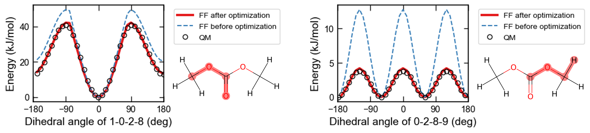

# Dihedral Parameter Optimization

## Overview

The **Dihedral Trainer** is a specialized trainer class in iMolCRAFT designed to optimize torsion (dihedral) force field parameters by directly matching quantum mechanics (QM) potential energy surfaces (PES). This approach ensures that the conformational preferences and energy barriers of molecules are accurately reproduced by the force field.

Unlike default GAFF parameters which may not accurately reproduce the conformational preferences of certain molecules, iMolCRAFT enables automated fitting of dihedral parameters to high-accuracy QM calculations. This is particularly important for systems where accurate torsional barriers and rotational preferences are critical for molecular dynamics simulations.

## Theoretical Foundation

### Dihedral Energy in Classical Force Fields

Dihedral (torsional) angles are defined by four consecutive atoms and describe the rotational energy around bonds. In GAFF, the dihedral potential is described as:

```{math}
E_{\text{dihedral}} = \sum_{\text{dihedrals}} K_d [1 + \cos(n\phi - \gamma)]
```

where:
- {math}`K_d` is the force constant (barrier height)
- {math}`n` is the periodicity
- {math}`\phi` is the dihedral angle
- {math}`\gamma` is the phase shift

### QM Potential Energy Surface (PES)

High-accuracy QM calculations (typically DFT such as ωB97X-D/6-311+G(2d,p)) are used to compute the conformational energy landscape by performing relaxed scans along dihedral angles. These PES calculations capture the true quantum mechanical behavior including electronic effects and are used as the reference for parameter optimization.

## Key Components

### DihedralCalculator

The `DihedralCalculator` class manages the setup and execution of dihedral parameter optimization:

**Initialization:**
```python
calculator = DihedralCalculator(atoms, molecule_name, directory="temp_directory")
```

**Key attributes:**
- `scan_list`: List of dihedral atom indices to optimize (e.g., `[1, 0, 3, 4]`)
- `qm_scan`: QM potential energy data for each dihedral
- `ff_scan`: FF potential energy data for each dihedral
- `qm_calculators`: QM calculation setup (Gaussian16, Psi4, etc.)
- `ff_calculators`: FF calculation setup with OpenMM

**Key methods:**
- `do_qmscan()`: Execute QM relaxed scans (computationally expensive)
- `do_ffscan(ffxml, angles="QM", ini_geom="FF")`: Calculate FF energies along QM scan angles

### Loss Function for Dihedral Fitting

The dihedral trainer compares QM and FF potential energy surfaces using a weighted loss function:

```{math}
\mathcal{L}_{\text{dihedral}} = \sum_{i} w_i (E_{\text{ff},i} - E_{\text{qm},i})^2
```

Multiple weighting schemes are available:

- **Uniform**: Equal weight to all points on the PES
- **Boltzmann**: Weight points by thermal population at a given temperature (higher energy points weighted less)
- **Auto zero-point**: Shift energies so that the QM minimum matches the FF minimum

### DihedralTrainer Workflow

The optimization process follows these steps:

1. **QM PES Calculation**: Perform relaxed dihedral scans at high QM level (or load pre-computed results)
2. **Gradient Scanning**: Optimize geometries along the dihedral angle while relaxing other degrees of freedom
3. **Initial FF PES**: Calculate FF energies using initial GAFF parameters
4. **Parameter Update**: Use gradient-based optimization to update dihedral parameters
5. **Relaxed Scan Update** (periodically): Re-optimize FF geometries with updated parameters and re-evaluate energies
6. **Convergence Check**: Monitor loss decrease and stop when converged

## Usage Example

### Step 1: Load or Calculate QM Reference Data

```python
from imolcraft.calculator import DihedralCalculator, load_g16scan
from imolcraft.io.rdkit import atoms2rdkit
from ase.io import read

# Read molecular structure
# Use the optimized PDB structure (from crafter or QM calculations)
pdbfile = "dmc.pdb"
atoms = read(pdbfile)
mol, mol2d, _ = atoms2rdkit(atoms)

# Initialize calculator
calculator = DihedralCalculator(atoms, "dmc", directory="temp_directory")

# View available dihedrals to optimize
print(calculator.scan_list)

# Option A: Perform QM scans (requires Gaussian16)
# calculator.do_qmscan()

# Option B: Load pre-computed QM scan results
# Load the specific dihedral scan log files you want to optimize
# For dihedral 0:
# calculator.qm_scan[0]["angle_deg"], \
# calculator.qm_scan[0]["energy_kjmol"], \
# calculator.qm_scan[0]["atoms"] = load_g16scan("dmc_dihed_0.log")

# # For dihedral 2:
# calculator.qm_scan[2]["angle_deg"], \
# calculator.qm_scan[2]["energy_kjmol"], \
# calculator.qm_scan[2]["atoms"] = load_g16scan("dmc_dihed_2.log")
```

### Step 2: Calculate Initial Force Field Energies

```python
# Compute FF energies along QM-optimized geometries
# Use the XML file generated by crafter (e.g., generated from GAFF parameters)
# See: examples/crafter/crystal/ or examples/crafter/liquid/ for how to generate the XML file
calculator.do_ffscan("dmc.xml", angles="QM", ini_geom="FF")
# dmc.xml is the force field file created by crafter with GAFF parameters
```

### Step 3: Set Up and Run Optimization

```python
from imolcraft.trainer import DihedralTrainer
from imolcraft.trainer.loss import loss_energy
from functools import partial

# Define loss function
lossfn = partial(loss_energy, 
                 weight_scheme="uniform",  # or "boltzmann", "nonboltzmann"
                 zeropoint="qmmin",        # or "auto", None
                 norm_var=True)

# Initialize trainer
# ffxml should be the same force field XML file from Step 2 (created by crafter)
trainer = DihedralTrainer(
    ffxml="dmc.xml",  # Force field XML generated by crafter
    pdbfile=pdbfile,
    calculator=calculator,
    loss_fn=lossfn,
    opt_fftypes=["PeriodicTorsionForce/proper_k"],  # Parameter types to optimize
    relax_steps=1,    # Perform relaxed scan every N steps
    lr=0.1,           # Learning rate
    clip=0.5          # Gradient clipping threshold
)

# Setup trainer
trainer.setup()

# Initial optimization with frequent relaxed scans (FF far from QM)
trainer.fit(steps=10)

# Increase relax_steps once FF approaches QM (converged structure, rare resampling)
trainer.relax_steps = 25
trainer.fit(steps=100)

# Monitor training
import matplotlib.pyplot as plt
plt.figure(figsize=(8, 5))
plt.yscale("log")
plt.plot(trainer.epochs, trainer.losses)
plt.xlabel("Epoch")
plt.ylabel("Loss (log scale)")
plt.title("Training Loss Curve")
plt.show()
```

If you encounter the error at `trainer = DihedralTrainer(...)`, it may be due to issues with the PDB file. You can try creating a new PDB file using the following code and loading it into the trainer:
```python
from imolcraft.crafter.asemol import aseatoms2pdb_bonded

# Convert ASE Atoms to PDB format with bonded information
atoms = read(pdbfile)
aseatoms2pdb_bonded(atoms, "dihedral_opt.pdb")
```

### Step 4: Evaluate Optimized Parameters

```python
# Calculate FF energies with optimized parameters
# The optimized XML file will be saved by the trainer
calculator.do_ffscan("dmc1_best.xml", angles="QM", ini_geom="FF")

# Compare before and after optimization
plt.figure(figsize=(10, 6))
plt.xlim(-180, 180)
plt.xticks([-180, -90, 0, 90, 180])

plt.plot(calculator.qm_scan[0]["angle_deg"], calculator.qm_scan[0]["energy_kjmol"], 
         marker="o", markersize=8, linestyle="none", label="QM (reference)", color="black")
plt.plot(calculator.ff_scan[0]["angle_deg"], calculator.ff_scan[0]["energy_kjmol"],
         linewidth=3, label="FF (optimized)")
plt.plot(calculator.ff_scan[0]["angle_deg"], ff_before_optimization,
         linestyle="--", linewidth=2, label="FF (before optimization)")

plt.xlabel("Dihedral Angle (degrees)")
plt.ylabel("Energy (kJ/mol)")
plt.legend(loc="upper right")
plt.title("Dihedral Parameter Optimization Result")
plt.tight_layout()
plt.show()
```



## Key Parameters

### DihedralTrainer Configuration

| Parameter | Type | Default | Description |
|-----------|------|---------|-------------|
| `ffxml` | str | - | Path to OpenMM-compatible force field XML file |
| `pdbfile` | str | - | Path to PDB file with molecular structure |
| `calculator` | DihedralCalculator | - | Calculator object with QM/FF data |
| `loss_fn` | function | - | Loss function (typically `loss_energy`) |
| `opt_fftypes` | list | - | Force field parameter types to optimize (e.g., `["PeriodicTorsionForce/proper_k"]`) |
| `relax_steps` | int | 1 | Frequency of relaxed scan updates (1 = every step, high = rarely) |
| `lr` | float | 0.01 | Learning rate for parameter updates |
| `clip` | float | 1.0 | Gradient clipping threshold (prevents large jumps) |

### Loss Function Parameters

| Parameter | Type | Options | Description |
|-----------|------|---------|-------------|
| `weight_scheme` | str | `"uniform"`, `"boltzmann"` | How to weight energy points on the PES |
| `zeropoint` | str | `"auto"`, `"qmmin"`, `None` | Energy reference point |
| `norm_var` | bool | `True`, `False` | Normalize by variance of QM energies |
| `temperature` | float | 500 | Temperature (K) for Boltzmann weighting |

## Frequently Asked Questions

### Q1: Which PDB file should I use?

**Answer:** Use the PDB file that represents the **optimized geometry of your molecule** from the crafter output or QM calculations.

- **Correct**: Use output from crafter of iMolCRAFT or your QM geometry optimization (e.g., `dmc.pdb` from final geometry)
- **Important**: The PDB structure must match the atoms and connectivity of the molecule where the QM scans were performed
- **Source**: See `examples/crafter/crystal/` or `examples/crafter/liquid` for how to generate the PDB file using the crafter module
- **Why**: The dihedral scan QM energies are computed from relaxed geometries, so the PDB must represent the same molecular structure as the QM scans

### Q2: Which force field XML file should I use?

**Answer:** Use an XML file generated **from GAFF parameters for your molecule by the crafter module**.

**How to generate the XML file using crafter:**
1. Use the crafter module to generate GAFF parameters for your molecule
   ```bash
   # See: examples/crafter/crystal/crystal.ipynb
   # for a complete example of how to use crafter
   ```
2. The crafter module outputs the force field XML file (e.g., `dmc.xml`)
   - This XML file contains GAFF parameters for your molecular structure
3. Use the generated XML file in all optimization steps (Step 2, Step 3, Step 4)

**Why**: The XML file must contain parameters that match your molecule's atom types. The crafter module automatically generates parameters specific to your molecular structure, ensuring compatibility with the dihedral optimization.

### Q3: Which QM scan log files should I load?

**Answer:** Load **ONLY the log files for the dihedral angles you want to optimize**.

**Guidelines:**
- The `calculator.scan_list` shows all available dihedrals that can be optimized
- You can select a subset of dihedrals by loading only their log files
- For example, if you only want to optimize dihedrals 0 and 2 (not 1):
  ```python
  calculator.qm_scan[0][...] = load_g16scan("dmc_dihed_0.log")
  calculator.qm_scan[2][...] = load_g16scan("dmc_dihed_2.log")
  ```
- Update `calculator.scan_list`, `calculator.qm_calculators`, `calculator.ff_calculators`, and `calculator.ff_scan` to match the selected dihedrals

**Why**: Each dihedral scan is independent and computationally expensive. Only load the scans for the torsions you plan to optimize in your force field to save resources and avoid introducing noise.

**Example:**
```python
# Select and optimize only dihedrals 0 and 2
calculator.scan_list = [calculator.scan_list[0], calculator.scan_list[2]]
calculator.qm_calculators = [calculator.qm_calculators[0], calculator.qm_calculators[2]]
calculator.ff_calculators = [calculator.ff_calculators[0], calculator.ff_calculators[2]]
calculator.qm_scan = [calculator.qm_scan[0], calculator.qm_scan[2]]
calculator.ff_scan = [calculator.ff_scan[0], calculator.ff_scan[2]]

calculator.qm_scan[0]["angle_deg"], \
calculator.qm_scan[0]["energy_kjmol"], \
calculator.qm_scan[0]["atoms"] = load_g16scan("dmc_dihed_0.log")

calculator.qm_scan[1]["angle_deg"], \
calculator.qm_scan[1]["energy_kjmol"], \
calculator.qm_scan[1]["atoms"] = load_g16scan("dmc_dihed_2.log")
```
