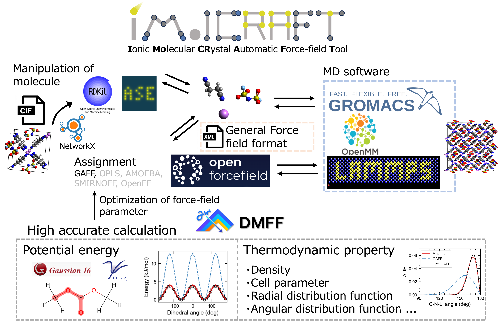

.. iMolCRAFT documentation master file, created by
   sphinx-quickstart on Wed Apr 30 15:45:17 2025.
   You can adapt this file completely to your liking, but it should at least
   contain the root `toctree` directive.

=======================
iMolCRAFT documentation
=======================

--------
Overview
--------
**iMolCRAFT** (**I**\ onic **Mol**\ ecular **CR**\ ystal **A**\ utomatic **F**\ orcefield **T**\ ool) is a Python package for classical molecular dynamics of organic molecules.

* Extracting molecule structures from crystal structures
* Assignment of force field parameters
* Point charge calculation
* Creating supercells and liquid configurations
* Optimization of force field parameters by static calculation and thermodynamic properties (RDF, density, etc.)
* Compatability with LAMMPS, GROMACS, and OpenMM

**iMolCRAFT** has been developed by `Ryoma Sasaki <https://srak-uf.github.io/>`_ at Institute of Science Tokyo, Japan, and is available under the MIT license.

.. toctree::
   :maxdepth: 2
   :caption: Main

   installation
   theory.rst

.. toctree::
   :maxdepth: 3
   :caption: Examples

   crystal
   .. liquid
   .. dihedral
   .. thermodyn_perturb

.. toctree::
   :caption: API Reference
   :hidden:
   :maxdepth: 2

   api/modules

